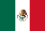

#  
# 通道概览

||&nbsp;&nbsp;国家|通道|
|--|-------|------|
||巴西|<label style="color:green">iugu通道</label>| 
|&nbsp;|墨西哥|<label style="color:green">sp通道</label>|
|&nbsp;|印度|<label style="color:green">dd通道</label>|
|&nbsp;|菲律宾|<label style="color:green">cs通道</label>&nbsp;&nbsp;&nbsp;&nbsp;<label style="color:green">le通道</label>|
||越南|<label style="color:green">ly通道</label>| 
